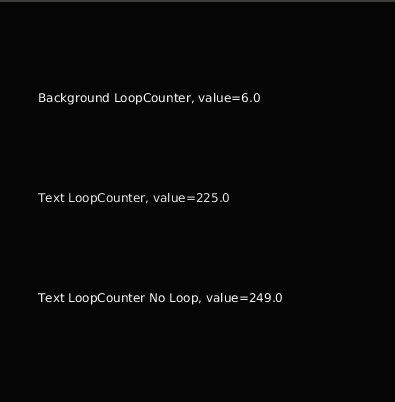

([Version en Castellano](README-ES.md))

#  Delay and Counter Utility Library for Processing 3 


Processing library including delays and counter 

## Example:

```

import ktxo.art.processing.util.*;

// Counter from 0 to 255 incrementing by 1 and looping: 0,1,2,....255,254,253,....,0,1....

LoopCounter backCounter = new LoopCounter(0, 0, 255, 1,  true); 

void setup() {
  size(400,400);
  frameRate(5);
}

void draw() {
  // Change background, loop between 0 and 255
  background(backCounter.next());
  
}
```

See also [examples/Screen/Screen.pde](examples/Screen/Screen.pde)




## Installation

1. Download latest version from [Releases](https://github.com/ktxoarts/processing_DelayCounterUtilityLibrary/releases)
2. Add the library to Processing, see [How to Install a Contributed Library](https://github.com/processing/processing/wiki/How-to-Install-a-Contributed-Library)
